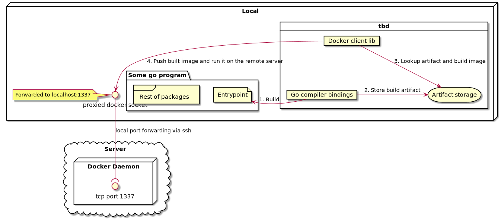

# tbd 👉 telegram bot deployer

## Motivation

The idea is to have a tool which deploys telegram bots built in go as docker containers on a vanilla root server.
No fancy schmancy AWS/Azure/GCP stuff needed.

## How ?

On the target server we have the docker (containerd) daemon running while exposing the docker API via an tcp endpoint.
For this matter the docker settings was modified and the docker (contained) daemon restarted.

After that this endpoint was forwarded via ssh to the local machine.

The environment variable `DOCKER_HOST` is modified before calling `tbd`, so it calls the remote docker (containerd) daemon
through the ssh tunnel.

The `tbd` binary builds (currently only) go programs and builds a distroless docker image where it packs the first build artifact.

Then it runs the artifact remotely on the server.

## License

This project is licensed under the GPL-3 license.
